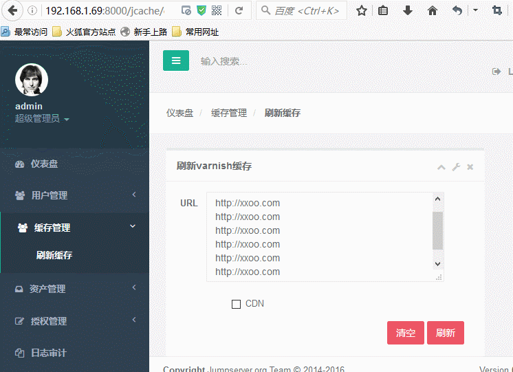
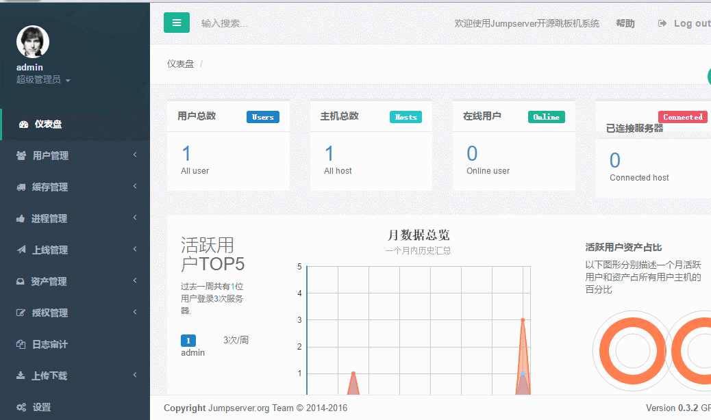

### 功能

> 二次开发于   [jumpserver](http://www.jumpserver.org/)

##特点

* 完全开源，GPL授权
* Python编写，容易再次开发
* 实现了跳板机基本功能，认证、授权、审计
* 集成了Ansible，批量命令等
* 支持WebTerminal
* Bootstrap编写，界面美观
* 自动收集硬件信息
* 录像回放
* 命令搜索
* 实时监控
* 批量上传下载

------

## 配合公司业务新增功能

* varnish 缓存刷新  (完成)
* 上线管理
* 进程管理(supervisor rpc)   (完成)

## 更新日志

> 2016-10-27 初步实现 web 操作 supervisor  rpc ,进行 进程管理
> 2016-11-16 实现 实时 tail 日志 websocket

